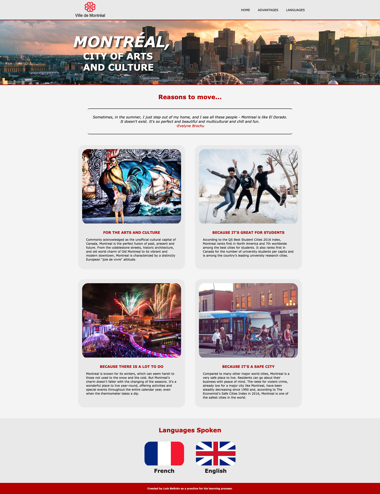

# Montreal

This is my first practice using HTML and CSS in a webpage.

## Table of contents

- [Overview](#overview)
  - [The challenge](#the-challenge)
  - [Screenshot](#screenshot)
  - [Links](#links)
- [My process](#my-process)
  - [Built with](#built-with)
  - [What I learned](#what-i-learned)
  - [Continued development](#continued-development)
- [Author](#author)

## Overview

### The challenge

Users should be able to:

- Use links at the top to navigate the web page.
- Use a basic responsive design.

### Screenshot

### Links

- Solution URL: [https://github.com/LuisCBeltran/montreal](https://github.com/LuisCBeltran/montreal)
- Live Site URL: [https://luiscbeltran.github.io/montreal/](https://luiscbeltran.github.io/montreal/)

## My process

### Built with

- Semantic HTML5 markup
- CSS
- Flexbox

### What I learned

I learnt how to use basic HTML and CSS in a webpage design.

### Continued development
I think I should continue practicing HTML so it can be more semantic.

## Author

- Website - [Luis C. Beltrán](https://github.com/LuisCBeltran)
- Frontend Mentor - [@LuisCBeltran](https://www.frontendmentor.io/profile/LuisCBeltran)
- Twitter - [@luisc_beltran](https://twitter.com/luisc_beltran)
